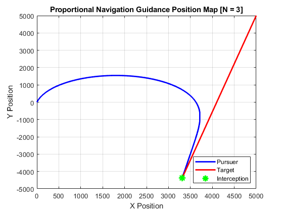
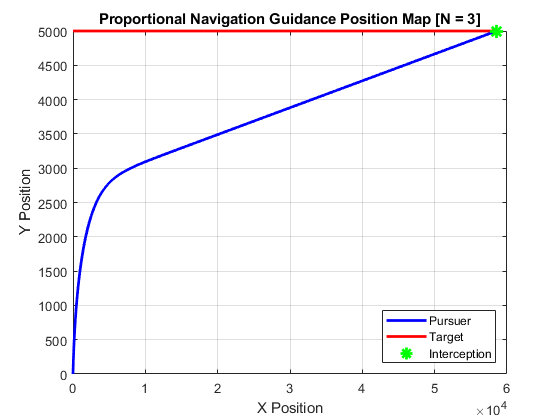
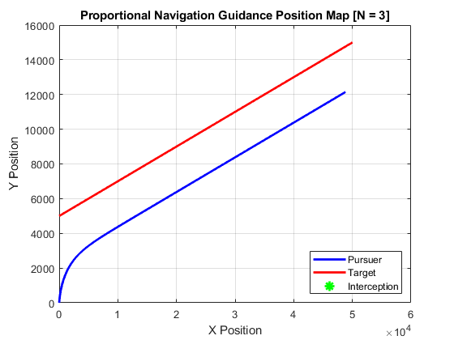

# Proportional-Pursuit Guidance System

The **Proportional-Pursuit** system simulates the motion of two bodies: one with a fixed velocity and heading (the **pursuer**) and the other with a fixed velocity but an adjustable heading (the **target**). This model demonstrates a fundamental proportional guidance algorithm, where the pursuer adjusts its heading based on the position of the target to attempt an intercept.

### Program Version 1

In this initial version, the focus is purely on the mathematical model. Real-world factors such as changing target velocities, air resistance, or limitations on the pursuer’s acceleration are ignored. The goal is to understand the core algorithm, making it an ideal starting point for more complex simulations in the future.

---

## Example Outputs

Below are three distinct examples showcasing different scenarios for the proportional-pursuit system.

### Example 1: Positive Pursuer Velocity, Negative Target Velocity

#### Parameters:
- **N (Navigation Constant)** = 3
- **Pursuer Initial Position** = (0, 0) [m]
- **Target Initial Position** = (5000, 5000) [m]
- **Pursuer Initial Velocity** = (10, 50) [m/s]
- **Target Initial Velocity** = (-9, -50) [m/s]
- **Time Step** = 0.001 [s]
- **Max Steps** = 300,000
- **Intercept Threshold** = 0.1 [m]

#### Output:
- **Intercept** was successful, occurring at **187.73 seconds** (Step 187,727).

### Example 2: Positive Pursuer Velocity, Positive X Target Velocity

#### Parameters:
- **N (Navigation Constant)** = 3
- **Pursuer Initial Position** = (0, 0) [m]
- **Target Initial Position** = (0, 5000) [m]
- **Pursuer Initial Velocity** = (10, 50) [m/s]
- **Target Initial Velocity** = (50, 0) [m/s]
- **Time Step** = 0.001 [s]
- **Max Steps** = 3,000,000
- **Intercept Threshold** = 0.1 [m]

#### Output:
- **Intercept** was successful, occurring at **1170.86 seconds** (Step 1,170,857).
- A **collision triangle** becomes evident at approximately the x = 1000 mark, which signifies that an intercept is inevitable in this energy-conserving system.

### Example 3: Equal Velocities of Pursuer and Target (Edge Case)

#### Parameters:
- **N (Navigation Constant)** = 3
- **Pursuer Initial Position** = (0, 0) [m]
- **Target Initial Position** = (0, 5000) [m]
- **Pursuer Initial Velocity** = (10, 50) [m/s]
- **Target Initial Velocity** = (50, 10) [m/s]
- **Time Step** = 0.001 [s]
- **Max Steps** = 1,000,000
- **Intercept Threshold** = 0.1 [m]

#### Output:
- **Intercept** was not successful and will never occur.
- In this edge case, the velocities of both the pursuer and the target are equal. Due to the energy-conserving nature of the system, no additional energy can be added, and no intercept is possible.

---

## Summary

This proportional-pursuit system demonstrates the interaction between a pursuer and a target under varying initial conditions. The algorithm successfully simulates intercepts when the target is moving towards the pursuer and the relative velocities allow for a collision. In cases of equal velocities or other specific scenarios, the intercept may not occur, highlighting the limitations of this energy-conserving system.

The results provide valuable insight into how simple proportional navigation principles can be applied to track and intercept moving targets. Future versions of this program will address real-world considerations such as changing velocities, acceleration limitations, and external forces like air resistance.